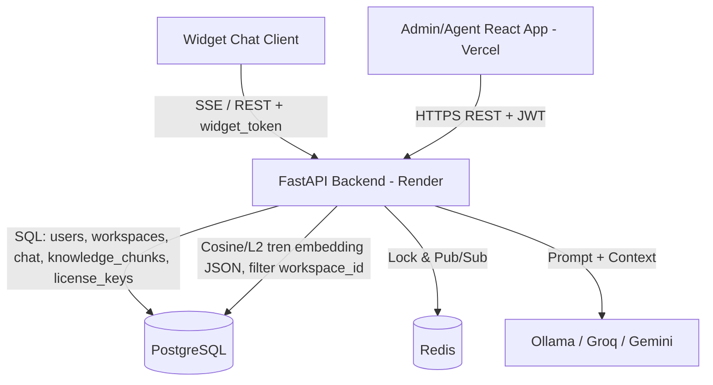

# FINAL REPORT — NovaChat AI

**Học phần:** Công nghệ Phần mềm K4 — Đồ án nghiệm thu (Tuần 10)
**Nhóm 1 — Đề tài:** NovaChat AI — Nền tảng Chatbot RAG + Human-in-the-loop cho CSKH doanh nghiệp SME
**Repository:** `uncletanh/CNPM-Group-1`

---

## 1. Quản trị sản phẩm & Luồng Agile (15%)

### 1.1 Tầm nhìn sản phẩm (Product Vision)
NovaChat AI giúp doanh nghiệp SME **tự động hóa khâu chăm sóc khách hàng**: một chatbot
biết trả lời dựa trên chính tài liệu của doanh nghiệp (RAG), và khi bot không đủ tự tin
thì **chuyển liền cho nhân viên thật** (Human-in-the-loop). Mục tiêu MVP: một nền tảng
SaaS multi-tenant chạy được thật, mỗi doanh nghiệp là một *workspace* dữ liệu độc lập.

### 1.2 Phạm vi MVP
**Trong scope:** Auth (JWT + Google SSO), Workspace + mời thành viên + RBAC (Admin/Agent),
Knowledge Base (nạp PDF/TXT/DOCX → RAG), Chat RAG streaming có trích dẫn nguồn, Omnibox
theo dõi hội thoại realtime, Human Takeover, Widget nhúng tùy biến.
**Ngoài scope (MVP):** đa ngôn ngữ, voice bot, analytics nâng cao, billing.

### 1.3 Minh chứng Agile
- **25 GitHub Issues** có acceptance criteria, gán nhãn `[Backend]/[Frontend]/[Lead]` theo Phase/Sprint — **100% đã đóng**.
- **35 Pull Request** (34 đã merge vào `main`) qua feature branch riêng cho từng fix/feature, mỗi PR có
  CI (test + coverage + SAST) chạy qua trước khi merge.
- Quy trình **Pair Programming** (Driver/Navigator) theo `reengineered_docs/11_Task_Assignment.md`.
- Giai đoạn cuối (persistence tri thức, RBAC, Freemium/License Key, vá lỗi production) được Lead
  điều phối trực tiếp với AI agent (Claude Code) theo mô hình *một PR nhỏ cho một vấn đề*: mỗi
  fix đều có branch riêng, test riêng, và review diff trước khi merge — xem mục 4.

### 1.4 User Story cốt lõi + Kịch bản BDD
**US: Khách hàng hỏi và bot trả lời theo tài liệu doanh nghiệp**
```gherkin
Feature: RAG chatbot trả lời theo tri thức doanh nghiệp

  Scenario: Câu hỏi có trong tài liệu
    Given Admin đã nạp tài liệu sản phẩm vào workspace
    When khách hàng hỏi một câu có thông tin trong tài liệu
    Then bot trả lời đúng nội dung và hiển thị nguồn (tên tài liệu, trang)

  Scenario: Câu hỏi ngoài tài liệu (chống hallucination)
    Given tri thức workspace không chứa câu trả lời
    When khách hàng hỏi
    Then bot KHÔNG bịa, trả lời "Tôi không có thông tin này, bạn có muốn gặp nhân viên không?"

  Scenario: Cách ly dữ liệu (multi-tenant)
    Given có workspace A và workspace B với tài liệu khác nhau
    When khách hàng của workspace A đặt câu hỏi
    Then bot chỉ truy hồi dữ liệu của workspace A, không lộ dữ liệu workspace B
```

---

## 2. Kiến trúc hệ thống & Thiết kế kỹ thuật (35%)

### 2.1 Phong cách kiến trúc — và lý do
Nhóm chọn **Modular Monolith kết hợp Event-driven** (không phải microservices).
Chi tiết đầy đủ trong `reengineered_docs/10_Software_Architecture.md` (có C4 model + ADR).

> **Lưu ý bảo vệ:** rubric gợi ý "microservices". Nhóm **chủ động** chọn Modular Monolith
> vì: team 5 người + timeline ngắn, microservices sẽ gây overhead DevOps/network không cần
> thiết. Hệ thống vẫn **phân tách module rõ ràng ở cấp thư mục** (`api`, `core`, `models`,
> `schemas`, `services`) và trải sẵn đường scale-out qua Redis Pub/Sub. Đây là quyết định
> kiến trúc có chủ đích, ghi trong ADR — không phải "monolith vì không đủ sức".

### 2.2 Sơ đồ Container (C4 Level 2)

*Ghi chú kiến trúc quan trọng:* pipeline RAG **không dùng vector DB riêng (ChromaDB) nữa**.
Bản đầu dùng ChromaDB persist ra filesystem của Render — vốn là **ephemeral** trên tier Free,
nên tri thức nạp lên **mất sau mỗi lần restart/redeploy**. Đã tái cấu trúc: embedding lưu thẳng
trong bảng `knowledge_chunks` (Postgres, cột JSON), cosine/L2 similarity tính bằng Python thay
vì ANN index — hợp lý ở quy mô KB của một SME (không cần index chuyên biệt), và tận dụng luôn
Postgres managed instance đã có (không thêm một hạ tầng cần vận hành riêng).

### 2.3 Data model & lựa chọn CSDL
- **PostgreSQL — nguồn sự thật duy nhất:** `User` (role toàn cục USER/STAFF/ADMIN + plan FREE/PRO),
  `Workspace` (+ `allowed_domains` JSON khóa domain nhúng, `message_count` cho hạn mức Freemium),
  `WorkspaceMember/Invitation` (role admin/agent theo từng workspace — độc lập với role toàn cục),
  `ChatSession`/`Message`, `KnowledgeChunk` (nội dung + embedding JSON + version theo model embedding),
  `LicenseKey` (kích hoạt gói PRO). Mọi bảng dữ liệu nghiệp vụ ràng buộc theo `workspace_id`
  (row-level multi-tenancy) — ACID + khóa ngoại giữa các bảng cùng một DB.
- **Redis:** distributed lock (handoff) + Pub/Sub đồng bộ realtime khi scale nhiều instance.
- Migration quản lý bằng **Alembic** (baseline + các revision tăng dần theo từng thay đổi schema),
  song song với hàm `ensure_*_schema()` tự vá cho DB dev cũ chưa qua migration.

### 2.4 An toàn & Bảo mật
- **Authentication:** JWT stateless; mật khẩu hash bằng `passlib[bcrypt]`.
- **Authorization — 2 tầng RBAC độc lập:**
  - *Theo workspace:* `admin`/`agent` (member) — quyết định ai sửa được cấu hình/thành viên/tri
    thức của một workspace cụ thể, kiểm tra qua `get_owned_workspace`/`get_workspace_access`.
  - *Toàn cục hệ thống:* `USER`/`STAFF`/`ADMIN` — quyết định ai vào được khu Admin Dashboard
    (quản lý License Key, đổi plan người dùng, tạo tài khoản Staff), enforce bằng dependency
    factory `require_role(*roles)` (`api/deps.py`), test trong `test_workspace_rbac.py` và
    `test_licensing.py`.
- **Monetization/License Key:** key sinh bằng `secrets` (CSPRNG, không theo quy luật đoán được),
  xác thực **chỉ đối chiếu DB** (không tự suy luận tính hợp lệ từ format chuỗi); endpoint kích
  hoạt bị **rate-limit 5 lần/phút/user** (sliding window) để chống brute-force đoán mã.
- **Widget:** không dùng JWT (tránh XSS) mà dùng `widget_token` riêng của workspace + khóa theo
  **nhiều domain** (`allowed_domains`, danh sách) qua `DynamicCORSMiddleware`.
- **AI safety:** guardrail chống hallucination + filter `workspace_id` bắt buộc + escape
  chống prompt injection + chỉ gửi 10 tin nhắn gần nhất cho model.
- **Rà bảo mật chủ động (19/07):** tự đọc lại toàn bộ luồng auth/RBAC/cách ly dữ liệu trước
  buổi bảo vệ, không chờ có báo lỗi. Tìm và sửa 2 lỗi mức trung bình: CORS phản chiếu origin
  dựa vào header client tự khai (không xác thực giá trị) khiến cả các endpoint chỉ dành Agent
  bị coi nhầm là công khai — đổi sang whitelist đúng path; và timing side-channel lúc login
  (bỏ qua bước bcrypt khi email không tồn tại) khiến đo được thời gian phản hồi để dò email đã
  đăng ký — sửa bằng cách luôn chạy đủ bcrypt. **Minh bạch về giới hạn còn lại:** phát hiện
  `SECRET_KEY` có fallback hardcode trong code nếu thiếu biến môi trường — biết rõ, chưa kịp
  sửa trước ngày bảo vệ, không giấu. Chi tiết đầy đủ ở `EVIDENCE.md` mục 6.

---

## 3. Chu trình DevOps & Tự động hóa (25%)

### 3.1 CI/CD Pipeline (GitHub Actions — `.github/workflows/ci.yml`)
- **Job backend:** `compileall` → chạy 8 test script + 2 bộ pytest dưới `coverage` → **cổng chặn
  `coverage report --fail-under=70`** → bước **SAST `bandit -r app --severity-level high`**.
- **Job frontend/widget (matrix):** `npm ci` + `lint` + `build`.
- Chạy trên push nhánh `main`/`feature/**` và mọi PR vào `main`. Pipeline **xanh liên tục** —
  toàn bộ PR gần nhất (bao gồm các PR vá lỗi production sát ngày bảo vệ) đều pass CI trước khi merge.

### 3.2 Kiểm thử tự động & Bảo mật (SAST)
- **8 test script backend trong CI**: auth (register/login/RBAC), chat RAG + streaming + citation,
  knowledge base, workspace CRUD, RBAC cách ly, Freemium/License Key/Admin RBAC/rate-limit, và
  cả 3 LLM provider (Ollama/Groq/Gemini) — cộng 2 bộ pytest (embeddings, retrieval).
- **Code Coverage = 78%** (đạt ngưỡng rubric > 70%), có cổng chặn merge nếu tụt dưới 70%.
- **SAST bằng Bandit**: **0 lỗi mức High** (1 Low, 6 Medium — các mức thấp hơn không chặn CI theo
  chủ đích, để pipeline không "đỏ oan" vì cảnh báo không trọng yếu).

### 3.3 Hạ tầng Cloud & vận hành — **đã deploy thật, demo trực tiếp trên Cloud**
- **Backend:** `https://cnpm-group-1.onrender.com` (Render, Postgres managed đi kèm).
- **Dashboard:** `https://cnpm-group-1.vercel.app` (Vercel, tự deploy trên mỗi lần merge vào `main`).
- Blueprint `render.yaml` (backend + frontend) + `DEPLOYMENT.md` (staging/production).
- Observability: logging JSON, `/health` (ping DB thật + uptime tiến trình), `/metrics`
  (Prometheus), rate limiting.
- **LLM linh hoạt để demo cloud:** hệ thống hỗ trợ 3 provider chọn qua biến `LLM_PROVIDER=auto`
  với thứ tự fallback `groq,gemini` (Ollama chỉ dùng khi chạy local, vì Render Free không chạy
  được model local). Cả ba dùng chung interface `generate()/generate_stream()` nên đổi provider
  **không phải sửa pipeline RAG**; API key đọc từ biến môi trường, **không commit vào repo**.

---

## 4. Khai thác & Tương tác với AI Agent (15%)

- **Agent chính:** Claude Code. **Dự phòng:** Cline / Gemini CLI. **LLM trong sản phẩm:** Ollama
  local khi phát triển, tự chuyển sang Groq/Gemini (`LLM_PROVIDER=auto`) khi deploy lên Render vì
  free tier không chạy được model local.
- **Nhật ký chi tiết 10 tuần:** thư mục `ai-logs/week-01.md … week-10.md`.
- **2 prompt hiệu quả nhất:** xem `PROMPTS.md` (chống race condition handoff; guardrail RAG + cách ly dữ liệu).
- **AI agent đã giúp ngoài viết code:** phân tích sản phẩm, sinh backlog & GitHub Issue, thiết kế
  kiến trúc C4/ADR, viết test, review bảo mật, sửa CI, viết tài liệu triển khai.
- **Bài học về hallucination / bẫy kỹ thuật (có minh chứng cụ thể, không phải lý thuyết):**
  - AI từng **quên filter `workspace_id`** khi query ChromaDB (nguy cơ lộ dữ liệu chéo) — nhóm bắt được khi đọc diff.
  - AI **hardcode `localhost`** trong URL API — lộ ra khi deploy thử Vercel.
  - AI viết test **phụ thuộc Redis thật** làm fail CI — sửa bằng fallback in-process.
  - **Snippet nhúng widget "tải được nhưng không hiện":** khách hàng báo widget load script
    thành công nhưng UI không xuất hiện trên Next.js. Debug thật (không đoán): kiểm tra
    `document.currentScript` fallback, thứ tự mount DOM, hydration — tất cả đều **đã đúng** từ
    trước. Nguyên nhân thật: snippet chỉ có `<script>`, thiếu `<link>` CSS; Tailwind build ra
    file `script.css` riêng mà JS không tự nạp → DOM mount đúng nhưng **không một class nào có
    hiệu lực** (không `position:fixed`, không kích thước) → coi như vô hình trên **mọi** nền
    tảng, không riêng Next.js. Sửa triệt để bằng `vite-plugin-css-injected-by-js` để nhúng CSS
    thẳng vào file JS — 1 thẻ `<script>` duy nhất là đủ ("Plug and Play" thật, không phải né
    triệu chứng). Xác minh bằng cách **thực thi thật** file JS build ra trong `jsdom` (không chỉ
    đọc code tĩnh) để chắc DOM/CSSOM đúng như kỳ vọng trước khi deploy.
  - **AI tự gây một lỗi production, rồi lần sửa đầu cũng sai:** thêm cột `allowed_domains` kiểu
    JSON cho Postgres, nhưng Postgres không có operator so sánh bằng (`=`) cho kiểu `json`
    thường → `SELECT DISTINCT` trong `GET /workspaces/` lỗi 500 **trên production**, dù test
    local (SQLite) xanh hết vì SQLite không strict như Postgres. Lần sửa đầu (đổi cột sang
    `JSONB` bằng migration) **tự nó lại deploy fail trên Render** (không rõ lý do, không truy
    cập được log) — và vì migration chạy trước khi server khởi động, deploy fail **chặn luôn
    mọi lần deploy sau**, kể cả các fix không liên quan. Phải đổi chiến lược: bỏ hẳn migration
    rủi ro, sửa thẳng vào logic query (dùng subquery thay `outerjoin + distinct`) — không đổi
    schema nên không thể fail ở bước migration nữa. Bài học: **một fix an toàn về mặt logic
    vẫn có thể mất tác dụng nếu cách triển khai (migration) rủi ro hơn bản thân lỗi** — và khi
    không có quyền xem log hạ tầng, ưu tiên phương án ít rủi ro nhất để khôi phục dịch vụ trước.
  - **Widget bị "lây" CSS từ trang khách (host page):** sau khi widget đã hiện đúng trên site
    demo thật, khách báo khung chat nhỏ hơn chữ, chữ bot to hơn hẳn chữ khách. Vì widget không
    dùng Shadow DOM/iframe (chủ đích, để nhẹ và tương thích rộng), nội dung bot render qua
    `ReactMarkdown` ra các thẻ HTML thường (`<p>/<li>/<h1-6>`) — nếu CSS toàn cục của trang host
    (site đó có typography riêng cho đọc thơ) nhắm vào đúng các thẻ này, nó có thể đè lên class
    Tailwind của widget. Sửa bằng CSS scope theo `#novachat-widget-root` với `!important` — kỹ
    thuật chuẩn các widget nhúng thật (Intercom/Crisp/Drift) dùng để tự bảo vệ khỏi CSS không
    kiểm soát được của host, đúng với lời hứa "dán vào là chạy y hệt mọi nơi".
  - **Một fix đúng hướng nhưng sửa lỗi lại cần 2 lần:** khi khách bấm "Gặp nhân viên" mà hết giờ
    chờ, backend gửi đúng tin nhắn "chưa có nhân viên" nhưng **quên đổi `session.status` về lại
    `bot_handling`** — nút "Gặp nhân viên" bị ẩn vĩnh viễn. Lần sửa đầu (PR #60) đổi status đúng
    hướng nhưng chỉ áp dụng cho phiên hết giờ **sau khi** fix lên production; verify thật cho
    thấy nút vẫn không quay lại vì phiên khách đang test đã bị kẹt **từ trước** (điều kiện cũ
    dựa vào một cờ đã bị code lỗi set từ trước, nên fix mới không bao giờ chạm tới). Lần sửa 2
    (PR #61) tách riêng "gửi tin nhắn 1 lần" khỏi "trả status" để việc trả status **luôn** chạy
    khi hết giờ, giúp cả phiên cũ bị kẹt cũng tự lành, không cần sửa tay dữ liệu production. Bài
    học: **verify sau khi deploy không dừng ở "trường hợp mới" — phải nghĩ tới cả trạng thái cũ
    đã bị hỏng từ trước khi fix tồn tại.**
  - Kết luận: AI tăng tốc rõ rệt nhưng **phải đọc diff, chạy test, và verify bằng dữ liệu thật
    (curl production, thực thi script trong jsdom) — không dừng ở "code trông đúng"**.

---

## 5. Bộ câu hỏi bảo vệ bắt buộc — trả lời

1. **Làm lại từ phần mềm nào / giải quyết vấn đề gì?** Sản phẩm mới, giải quyết bài toán CSKH
   thủ công tốn người của SME bằng chatbot RAG tự trả lời theo tài liệu + human takeover.
2. **Vì sao chọn MVP này?** Nhỏ, demo được, dữ liệu vào/ra rõ ràng, có 1 tính năng AI giá trị,
   không cần dữ liệu nhạy cảm.
3. **Tính năng AI là gì?** RAG chatbot: truy hồi tài liệu doanh nghiệp → sinh câu trả lời có
   trích dẫn nguồn, có guardrail chống bịa.
4. **Codex/AI agent giúp gì ngoài viết code?** Phân tích sản phẩm, sinh issue, thiết kế kiến
   trúc, viết test, review bảo mật, fix CI, viết tài liệu.
5. **Prompt tốt nhất?** Xem `PROMPTS.md` — prompt chống race condition handoff và prompt guardrail RAG.
6. **AI đã tạo lỗi gì?** Quên filter workspace_id; hardcode localhost; test phụ thuộc Redis; thêm
   cột Postgres kiểu `json` khiến `SELECT DISTINCT` lỗi 500 trên production (không lỗi ở local
   SQLite); lần sửa đầu (migration ALTER cột) tự nó deploy fail trên Render, chặn luôn các deploy
   sau — phải đổi sang fix không cần đổi schema; quên đổi `session.status` về lại `bot_handling`
   sau khi hết giờ chờ nhân viên (nút "Gặp nhân viên" bị ẩn vĩnh viễn), và lần sửa đầu chỉ áp
   dụng cho phiên mới, phải sửa lần 2 để tự chữa cả phiên cũ đã bị kẹt từ trước. Chi tiết đầy đủ
   ở mục 4.
7. **Phát hiện lỗi bằng cách nào?** Đọc diff trong PR, chạy test tay, chạy CI, test cách ly 2
   workspace; với lỗi production: gọi thật API bằng `curl` (tạo tài khoản mới, gọi endpoint lỗi)
   để xác nhận đúng nguyên nhân trước khi sửa, không đoán; với lỗi widget: thực thi script build
   ra trong `jsdom` để xác nhận DOM/CSS đúng như kỳ vọng, không chỉ đọc code tĩnh.
8. **Có đọc diff không?** Có — mọi PR đều qua review của Lead trước khi merge.
9. **Test nào chứng minh chạy đúng?** 8 test script CI, ví dụ `test_phase4_chat.py` (streaming + citation),
   `test_workspace_rbac.py` (chặn truy cập trái phép), `test_auth_users.py` (đăng nhập/RBAC),
   `test_llm_provider.py` (Ollama/Groq/Gemini/fallback), `test_licensing.py` (Freemium/License
   Key/rate-limit brute-force). Coverage 78%, CI xanh trên cloud, đã verify lại bằng dữ liệu thật
   trên production sau mỗi lần deploy (không chỉ tin CI xanh).
10. **Dữ liệu nào gửi vào AI model?** System prompt của workspace + chunk truy hồi (đúng workspace) +
    tối đa 10 tin nhắn gần nhất + câu hỏi. Không gửi mật khẩu/dữ liệu workspace khác. **Đánh đổi có ý thức:**
    khi dùng Ollama (local) dữ liệu không rời hạ tầng nhóm; khi dùng fallback cloud (Groq/Gemini) để demo,
    dữ liệu câu hỏi + đoạn tài liệu được gửi tới dịch vụ ngoài — đổi provider chỉ bằng một biến môi trường.
11. **Người dùng kiểm soát output AI?** Có — kết quả được đánh dấu AI-generated, hiển thị nguồn, và
    khách có thể yêu cầu "Gặp nhân viên"; nhân viên có thể tiếp quản/ghi đè.
12. **Bỏ AI feature còn giá trị không?** Còn — vẫn là nền tảng quản lý hội thoại + CSKH bởi người
    thật, nhưng mất lợi thế tự động hóa (giá trị cốt lõi).

---

## 6. Trạng thái hoàn thiện trước buổi bảo vệ
- [x] **Code coverage 78%** (cổng chặn `--fail-under=70`) + **SAST Bandit 0 High** trong CI — pipeline xanh trên cloud.
- [x] **Fallback LLM cloud (Groq/Gemini)** đã cấu hình `LLM_PROVIDER=auto` trên Render — demo online không phụ thuộc máy local.
- [x] **Deploy thật, có link live:** backend `cnpm-group-1.onrender.com`, dashboard `cnpm-group-1.vercel.app` — đã demo thử API thật trên production, không phải localhost.
- [x] **Persistence tri thức** (bug nặng nhất phát hiện sau khi deploy: tri thức mất khi Render restart do ChromaDB dùng filesystem tạm) — đã fix, verify bằng cách restart server thật và xác nhận dữ liệu còn.
- [x] **Vá lỗi 500 phát hiện ngay trước ngày bảo vệ** trên `GET /workspaces/` (Postgres + cột JSON) — verify lại bằng `curl` thật trên production, không chỉ tin CI xanh.
- [x] **Vá lỗi UI widget + Human Handoff phát hiện qua test thật trên site khách** (khung/chữ widget bị host CSS ảnh hưởng, nút "Gặp nhân viên" kẹt vĩnh viễn sau khi hết giờ chờ) — verify lại bằng `curl` thật + chờ đủ giờ timeout trên production, không chỉ tin CI xanh.
- [x] **Rà bảo mật chủ động, sửa 2 lỗi mức trung bình** (CORS phản chiếu origin sai path, timing side-channel lúc login) — xem `EVIDENCE.md` mục 6.
- [ ] **Còn 1 lỗi bảo mật mức nghiêm trọng chưa sửa** (`SECRET_KEY` fallback hardcode) — ưu tiên cao nhất trong `TODO_BAO_VE.md`, cần xong trước giờ bảo vệ.
- [ ] Đồng bộ slide (12–15 trang) với code thật (Freemium/License Key, RBAC 2 tầng, không còn ChromaDB) và luyện vấn đáp cá nhân — **mỗi thành viên ôn đúng phần mình đã làm**, không cần biết hết toàn bộ hệ thống.
- [ ] Diễn tập lại đúng 3 kịch bản BDD ở mục 1.4 **trên link cloud thật** trước giờ bảo vệ, tránh lỗi bất ngờ khi demo trực tiếp.

---

## 7. Phân công & đóng góp
| Vai trò | Thành viên | Đóng góp chính |
|---|---|---|
| Lead / System Architect | Nguyễn Tiến Anh | Boilerplate, kiến trúc, CI/CD, deploy, Redis lock, review PR |
| Backend & AI (Pair 1) | Lê Xuân Hiệp, Đào Minh Hiếu | Auth/Workspace API, RAG ingestion, LLM (Ollama + Groq/Gemini), streaming SSE, guardrail, test/coverage |
| Frontend & UI/UX (Pair 2) | Vũ Công Minh Thái, Trương Gia Bình | Login/Dashboard, Knowledge Base UI, Omnibox, Widget, Color Picker |

*Chi tiết quy trình làm việc với AI agent theo từng tuần: xem thư mục `ai-logs/`.*
