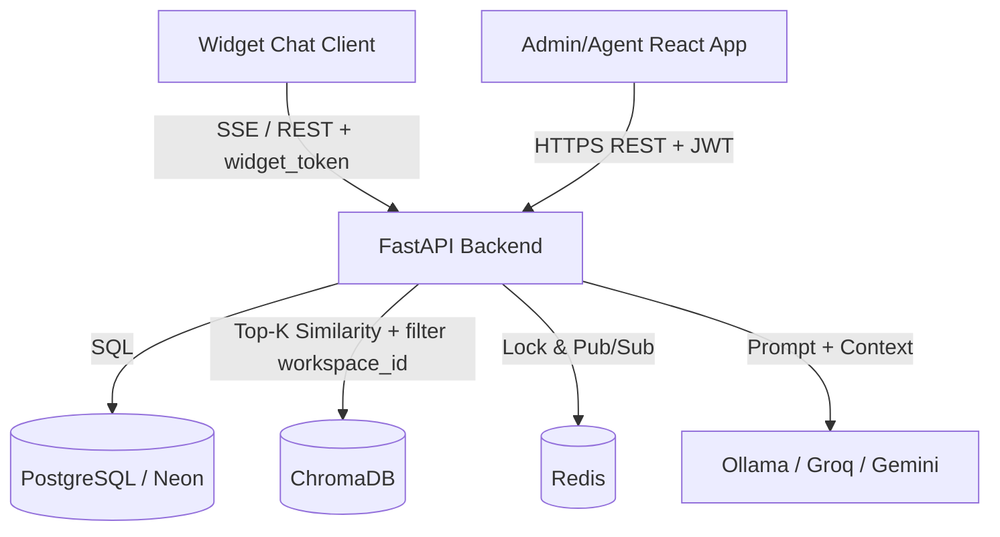

# FINAL REPORT — NovaChat AI

**Học phần:** Công nghệ Phần mềm K4 — Đồ án nghiệm thu (Tuần 10)
**Nhóm 1 — Đề tài:** NovaChat AI — Nền tảng Chatbot RAG + Human-in-the-loop cho CSKH doanh nghiệp SME
**Repository:** `uncletanh/CNPM-Group-1`

---

## 1. Quản trị sản phẩm & Luồng Agile (15%)

### 1.1 Tầm nhìn sản phẩm (Product Vision)
NovaChat AI giúp doanh nghiệp SME **tự động hóa khâu chăm sóc khách hàng**: một chatbot
biết trả lời dựa trên chính tài liệu của doanh nghiệp (RAG), và khi bot không đủ tự tin
thì **chuyển liền cho nhân viên thật** (Human-in-the-loop). Mục tiêu MVP: một nền tảng
SaaS multi-tenant chạy được thật, mỗi doanh nghiệp là một *workspace* dữ liệu độc lập.

### 1.2 Phạm vi MVP
**Trong scope:** Auth (JWT + Google SSO), Workspace + mời thành viên + RBAC (Admin/Agent),
Knowledge Base (nạp PDF/TXT/DOCX → RAG), Chat RAG streaming có trích dẫn nguồn, Omnibox
theo dõi hội thoại realtime, Human Takeover, Widget nhúng tùy biến.
**Ngoài scope (MVP):** đa ngôn ngữ, voice bot, analytics nâng cao, billing.

### 1.3 Minh chứng Agile
- **22 GitHub Issues** có acceptance criteria, gán nhãn `[Backend]/[Frontend]/[Lead]` theo Phase/Sprint.
- **~10 Pull Request đã merge** vào `main` qua feature branch + code review của Lead.
- Quy trình **Pair Programming** (Driver/Navigator) theo `reengineered_docs/11_Task_Assignment.md`.

### 1.4 User Story cốt lõi + Kịch bản BDD
**US: Khách hàng hỏi và bot trả lời theo tài liệu doanh nghiệp**
```gherkin
Feature: RAG chatbot trả lời theo tri thức doanh nghiệp

  Scenario: Câu hỏi có trong tài liệu
    Given Admin đã nạp tài liệu sản phẩm vào workspace
    When khách hàng hỏi một câu có thông tin trong tài liệu
    Then bot trả lời đúng nội dung và hiển thị nguồn (tên tài liệu, trang)

  Scenario: Câu hỏi ngoài tài liệu (chống hallucination)
    Given tri thức workspace không chứa câu trả lời
    When khách hàng hỏi
    Then bot KHÔNG bịa, trả lời "Tôi không có thông tin này, bạn có muốn gặp nhân viên không?"

  Scenario: Cách ly dữ liệu (multi-tenant)
    Given có workspace A và workspace B với tài liệu khác nhau
    When khách hàng của workspace A đặt câu hỏi
    Then bot chỉ truy hồi dữ liệu của workspace A, không lộ dữ liệu workspace B
```

---

## 2. Kiến trúc hệ thống & Thiết kế kỹ thuật (35%)

### 2.1 Phong cách kiến trúc — và lý do
Nhóm chọn **Modular Monolith kết hợp Event-driven** (không phải microservices).
Chi tiết đầy đủ trong `reengineered_docs/10_Software_Architecture.md` (có C4 model + ADR).

> **Lưu ý bảo vệ:** rubric gợi ý "microservices". Nhóm **chủ động** chọn Modular Monolith
> vì: team 5 người + timeline ngắn, microservices sẽ gây overhead DevOps/network không cần
> thiết. Hệ thống vẫn **phân tách module rõ ràng ở cấp thư mục** (`api`, `core`, `models`,
> `schemas`, `services`) và trải sẵn đường scale-out qua Redis Pub/Sub. Đây là quyết định
> kiến trúc có chủ đích, ghi trong ADR — không phải "monolith vì không đủ sức".

### 2.2 Sơ đồ Container (C4 Level 2)


### 2.3 Data model & lựa chọn CSDL
- **PostgreSQL (SQL):** User, Workspace, WorkspaceMember/Invitation, ChatSession, Message —
  cần ACID + quan hệ khóa ngoại; mọi bảng ràng buộc theo `workspace_id` (row-level multi-tenancy).
- **ChromaDB (Vector/NoSQL):** mỗi workspace = 1 collection riêng → cách ly dữ liệu RAG tuyệt đối.
- **Redis:** distributed lock (handoff) + Pub/Sub đồng bộ realtime khi scale nhiều instance.
- Migration quản lý bằng **Alembic** (`20260715_01_phase4_baseline.py`).

### 2.4 An toàn & Bảo mật
- **Authentication:** JWT stateless; mật khẩu hash bằng `passlib[bcrypt]`.
- **Authorization:** RBAC Admin/Agent kiểm tra qua Dependency Injection (`api/deps.py`),
  có test `test_workspace_rbac.py` chặn truy cập chéo workspace.
- **Widget:** không dùng JWT (tránh XSS) mà dùng `widget_token` riêng của workspace + khóa
  theo domain (`allowed_origin`) qua `DynamicCORSMiddleware`.
- **AI safety:** guardrail chống hallucination + filter `workspace_id` bắt buộc + escape
  chống prompt injection + chỉ gửi 10 tin nhắn gần nhất cho model.

---

## 3. Chu trình DevOps & Tự động hóa (25%)

### 3.1 CI/CD Pipeline (GitHub Actions — `.github/workflows/ci.yml`)
- **Job backend:** `compileall` → chạy 7 test script dưới `coverage` → **cổng chặn `coverage report --fail-under=70`** → bước **SAST `bandit -r app --severity-level high`**.
- **Job frontend/widget (matrix):** `npm ci` + `lint` + `build`.
- Chạy trên push nhánh `main`/`feature/**` và mọi PR vào `main`. Pipeline **xanh** trên cloud (run #9).

### 3.2 Kiểm thử tự động & Bảo mật (SAST)
- **7 test script backend trong CI**: auth (register/login/RBAC), chat RAG + streaming + citation,
  knowledge base, workspace CRUD, RBAC cách ly, và cả 3 LLM provider (Ollama/Groq/Gemini).
- **Code Coverage = 73%** (đạt ngưỡng rubric > 70%), có cổng chặn merge nếu tụt dưới 70%.
- **SAST bằng Bandit**: 0 lỗi mức High. Cấu hình chỉ fail ở mức nghiêm trọng để pipeline không "đỏ oan".

### 3.3 Hạ tầng Cloud & vận hành
- Blueprint `render.yaml` (backend + frontend) + `DEPLOYMENT.md` (staging/production).
- Observability: logging JSON, `/health`, `/metrics` (Prometheus), rate limiting.
- **LLM linh hoạt để demo cloud:** hệ thống hỗ trợ 3 provider chọn qua biến `LLM_PROVIDER`:
  **Ollama** (local, mặc định — miễn phí, dữ liệu không rời máy) và hai fallback cloud
  **Groq** / **Gemini** (dùng khi deploy vì Ollama không chạy trên free tier Render).
  Cả ba dùng chung interface `generate()/generate_stream()` nên đổi provider **không phải sửa pipeline RAG**;
  API key đọc từ biến môi trường, **không commit vào repo**.

---

## 4. Khai thác & Tương tác với AI Agent (15%)

- **Agent chính:** Claude Code. **Dự phòng:** Cline / Gemini CLI. **LLM trong sản phẩm:** Ollama local (mặc định), có fallback cloud Groq/Gemini cho môi trường deploy.
- **Nhật ký chi tiết 10 tuần:** thư mục `ai-logs/week-01.md … week-10.md`.
- **2 prompt hiệu quả nhất:** xem `PROMPTS.md` (chống race condition handoff; guardrail RAG + cách ly dữ liệu).
- **AI agent đã giúp ngoài viết code:** phân tích sản phẩm, sinh backlog & GitHub Issue, thiết kế
  kiến trúc C4/ADR, viết test, review bảo mật, sửa CI, viết tài liệu triển khai.
- **Bài học về hallucination / bẫy kỹ thuật:**
  - AI từng **quên filter `workspace_id`** khi query ChromaDB (nguy cơ lộ dữ liệu chéo) — nhóm bắt được khi đọc diff.
  - AI **hardcode `localhost`** trong URL API — lộ ra khi deploy thử Vercel.
  - AI viết test **phụ thuộc Redis thật** làm fail CI — sửa bằng fallback in-process.
  - Kết luận: AI tăng tốc rõ rệt nhưng **phải đọc diff, chạy test và chịu trách nhiệm cuối cùng**.

---

## 5. Bộ câu hỏi bảo vệ bắt buộc — trả lời

1. **Làm lại từ phần mềm nào / giải quyết vấn đề gì?** Sản phẩm mới, giải quyết bài toán CSKH
   thủ công tốn người của SME bằng chatbot RAG tự trả lời theo tài liệu + human takeover.
2. **Vì sao chọn MVP này?** Nhỏ, demo được, dữ liệu vào/ra rõ ràng, có 1 tính năng AI giá trị,
   không cần dữ liệu nhạy cảm.
3. **Tính năng AI là gì?** RAG chatbot: truy hồi tài liệu doanh nghiệp → sinh câu trả lời có
   trích dẫn nguồn, có guardrail chống bịa.
4. **Codex/AI agent giúp gì ngoài viết code?** Phân tích sản phẩm, sinh issue, thiết kế kiến
   trúc, viết test, review bảo mật, fix CI, viết tài liệu.
5. **Prompt tốt nhất?** Xem `PROMPTS.md` — prompt chống race condition handoff và prompt guardrail RAG.
6. **AI đã tạo lỗi gì?** Quên filter workspace_id; hardcode localhost; test phụ thuộc Redis; model
   nhỏ đôi lúc diễn đạt lủng củng.
7. **Phát hiện lỗi bằng cách nào?** Đọc diff trong PR, chạy test tay, chạy CI, test cách ly 2 workspace.
8. **Có đọc diff không?** Có — mọi PR đều qua review của Lead trước khi merge.
9. **Test nào chứng minh chạy đúng?** 7 test script CI, ví dụ `test_phase4_chat.py` (streaming + citation),
   `test_workspace_rbac.py` (chặn truy cập trái phép), `test_auth_users.py` (đăng nhập/RBAC),
   `test_llm_provider.py` (Ollama/Groq/Gemini/fallback). Coverage 73%, CI xanh trên cloud.
10. **Dữ liệu nào gửi vào AI model?** System prompt của workspace + chunk truy hồi (đúng workspace) +
    tối đa 10 tin nhắn gần nhất + câu hỏi. Không gửi mật khẩu/dữ liệu workspace khác. **Đánh đổi có ý thức:**
    khi dùng Ollama (local) dữ liệu không rời hạ tầng nhóm; khi dùng fallback cloud (Groq/Gemini) để demo,
    dữ liệu câu hỏi + đoạn tài liệu được gửi tới dịch vụ ngoài — đổi provider chỉ bằng một biến môi trường.
11. **Người dùng kiểm soát output AI?** Có — kết quả được đánh dấu AI-generated, hiển thị nguồn, và
    khách có thể yêu cầu "Gặp nhân viên"; nhân viên có thể tiếp quản/ghi đè.
12. **Bỏ AI feature còn giá trị không?** Còn — vẫn là nền tảng quản lý hội thoại + CSKH bởi người
    thật, nhưng mất lợi thế tự động hóa (giá trị cốt lõi).

---

## 6. Trạng thái hoàn thiện trước buổi bảo vệ
- [x] **Code coverage 73%** (cổng chặn `--fail-under=70`) + **SAST Bandit** trong CI — pipeline xanh trên cloud.
- [x] **Fallback LLM cloud (Groq/Gemini)** đã có trong code, chọn qua `LLM_PROVIDER` — gỡ rào cản demo online.
- [ ] **Việc còn lại (ưu tiên #1):** thực sự deploy backend lên Render với `LLM_PROVIDER=groq` + điền `GROQ_API_KEY`,
  deploy frontend lên Vercel, và lấy **link live** để demo trực tiếp trên hội đồng.
- [ ] Đồng bộ slide với code thật (Ollama/Groq/SSE, Modular Monolith) và luyện vấn đáp cá nhân.

---

## 7. Phân công & đóng góp
| Vai trò | Thành viên | Đóng góp chính |
|---|---|---|
| Lead / System Architect | Nguyễn Tiến Anh | Boilerplate, kiến trúc, CI/CD, deploy, Redis lock, review PR |
| Backend & AI (Pair 1) | Lê Xuân Hiệp, Đào Minh Hiếu | Auth/Workspace API, RAG ingestion, LLM (Ollama + Groq/Gemini), streaming SSE, guardrail, test/coverage |
| Frontend & UI/UX (Pair 2) | Vũ Công Minh Thái, Trương Gia Bình | Login/Dashboard, Knowledge Base UI, Omnibox, Widget, Color Picker |

*Chi tiết quy trình làm việc với AI agent theo từng tuần: xem thư mục `ai-logs/`.*
