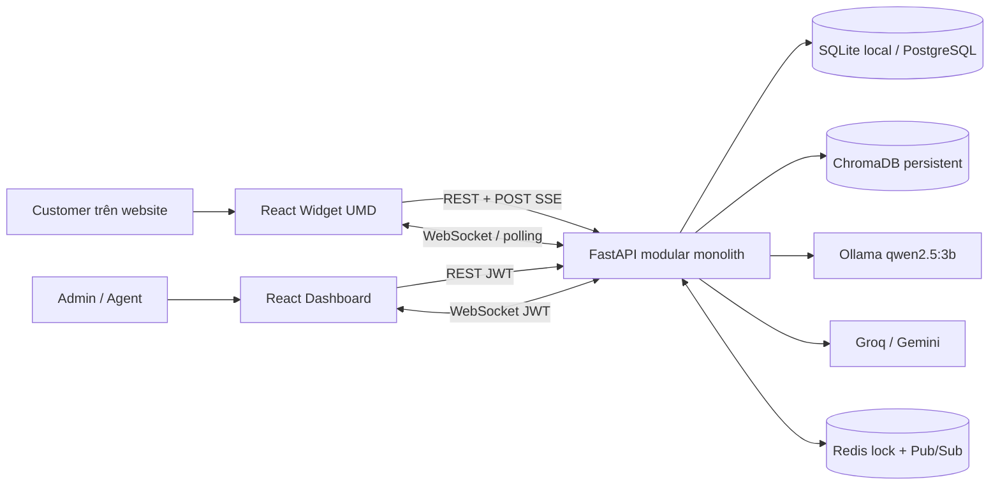
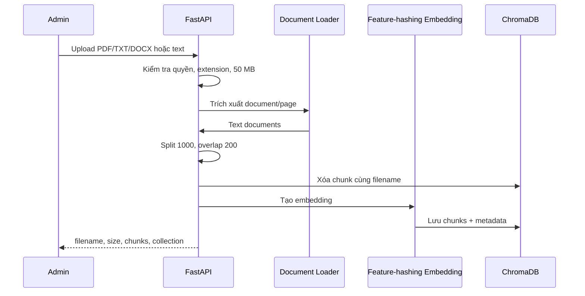

# 10. Kiến trúc phần mềm NovaChat AI

Ngày cập nhật: **16/07/2026**. Tài liệu này mô tả code hiện tại, không phải kiến trúc giả định.

## 1. Phong cách kiến trúc

NovaChat AI là **modular monolith**:

- Một FastAPI backend chứa auth, workspace, RAG, chat và handoff.
- Một React/Vite dashboard cho Admin/Agent.
- Một React/Vite Library Mode widget độc lập.
- PostgreSQL/SQLite lưu dữ liệu quan hệ.
- ChromaDB persistent lưu vector theo workspace.
- Redis tùy chọn cho distributed lock và Pub/Sub.
- Ollama local cùng Groq/Gemini cloud dùng chung interface và hỗ trợ fallback.

Thiết kế này phù hợp MVP. Repo không dùng Next.js, Preact, Celery, S3/R2 hoặc OpenAI ở thời điểm hiện tại.

## 2. Sơ đồ container



## 3. Cấu trúc code

```text
backend/app/
├── api/deps.py                 # JWT/current user
├── api/v1/auth.py              # register/login/Google OAuth
├── api/v1/users.py             # profile/password/users
├── api/v1/workspaces.py        # workspace/RBAC/KB/widget config
├── api/v1/chat.py              # RAG/SSE/history/handoff/WebSocket
├── core/security.py            # password/JWT
├── db/session.py               # SQLAlchemy + legacy schema helpers
├── db/chroma.py                # persistent Chroma client
├── models/                     # User, Workspace, Session, Message
├── schemas/                    # Pydantic contracts
├── services/llm.py             # Ollama/Groq/Gemini + fallback
├── services/realtime.py        # WebSocket, Redis Pub/Sub/lock
└── services/observability.py   # JSON log, metrics, rate limit

frontend/src/
├── pages/Dashboard.tsx
├── pages/WorkspaceManagement.tsx
├── pages/BotConfig.tsx
├── pages/KnowledgeBase.tsx
├── pages/Omnibox.tsx
├── pages/Analytics.tsx
├── pages/SystemSettings.tsx
└── services/api.ts

widget/src/
├── config.ts                   # data-* và Vite env
├── api.ts                      # SSE/WebSocket/poll/history
└── App.tsx                     # widget UI/state
```

## 4. Domain và dữ liệu

### SQL entities

- **User:** email, password hash, global role, active flag.
- **Workspace:** owner, system prompt, widget token/origin và widget settings.
- **WorkspaceMember:** user + workspace + role `admin`/`agent`, unique theo cặp.
- **WorkspaceInvitation:** email, role, token, status, hạn 7 ngày.
- **ChatSession:** session key, status, assigned Agent và các mốc handoff/fallback.
- **Message:** session, sender (`user`, `bot`, `agent`, `system`), content, timestamp.

Các trạng thái session:

```text
bot_handling -> waiting_human -> human_handling -> resolved
      ^                                             |
      +------------- customer gửi tin mới ----------+
```

### Vector data

- Collection: `workspace_<workspace_id>_knowledge`.
- Metadata chính: `workspace_id`, `source_filename`, `chunk_index`, `file_size`, `file_type`, `uploaded_at`, và `page` nếu loader cung cấp.
- Xóa workspace sẽ xóa collection.
- Upload cùng filename sẽ xóa vector cũ trước khi thêm mới.

Chroma collection riêng là biên tách vector chính; SQL endpoint vẫn phải kiểm tra owner/membership trước mọi thao tác admin.

## 5. Knowledge ingestion



Ingestion hiện đồng bộ trong HTTP request. Chưa có OCR, object storage, queue hoặc worker.

## 6. RAG và LLM

1. Lưu message của Customer và lấy/tạo `ChatSession`.
2. Nếu session đang chờ/được Agent xử lý, không gọi RAG/LLM.
3. Kiểm tra một số regex prompt injection.
4. Query Chroma Top-K (`ChatRequest.top_k` từ 1 đến 5).
5. Loại chunk rỗng, chứa mẫu injection hoặc distance lớn hơn `RAG_MAX_DISTANCE`.
6. Nếu không còn context, chuyển `waiting_human`, báo Agent và không gọi LLM.
7. Nếu có context, thêm tối đa `CHAT_HISTORY_LIMIT=10` message trước đó vào prompt.
8. Gọi provider đã chọn, thường hoặc streaming; fallback chỉ đổi provider trước chunk đầu tiên.
9. Lưu answer và trả sources.

Embedding dùng feature-hashing 384 chiều, chuẩn hóa vector và bổ sung đặc trưng từ không dấu để chạy nhanh trên Render Free. Cách này ưu tiên tốc độ và tìm kiếm theo từ khóa hơn độ hiểu ngữ nghĩa của transformer. Generation hỗ trợ `ollama`, `groq`, `gemini` và `auto`; chế độ `auto` mặc định thử `ollama,groq,gemini`, bỏ qua cloud provider chưa có API key.

## 7. API và realtime

### REST/SSE

- Auth/users/workspaces dùng REST JSON.
- Upload dùng multipart form-data.
- `POST /api/v1/chat/{workspace_id}` trả answer đầy đủ.
- `POST /api/v1/chat/{workspace_id}/stream` trả SSE events `session`, `chunk`, `human`, `done`, `error`.
- Widget dùng history và poll để khôi phục/fallback.

### WebSocket

`/api/v1/chat/{workspace_id}/ws` nhận query `role=agent|widget`.

- Agent xác thực bằng JWT và membership.
- Widget xác thực bằng widget token, session key và optional origin.
- Connection được giữ trong memory của instance.
- Redis channel `novachat:realtime` chuyển event giữa các instance.

WebSocket truyền tín hiệu thay đổi; dữ liệu bền vẫn nằm trong SQL và được client fetch/poll lại.

## 8. Human Handoff và concurrency

- Customer request hoặc RAG confidence thấp đặt session thành `waiting_human`.
- Agent takeover sử dụng Redis lock `novachat:takeover:<session_id>`.
- Conditional SQL update chỉ assign khi `assigned_agent_id IS NULL`.
- Reply yêu cầu session `human_handling` và đúng assigned Agent.
- Resolve đặt `resolved` và báo widget/Agent.
- Fallback 60 giây chạy bằng asyncio task; poll kiểm tra lại timeout để bù một phần.

Không có Redis, hệ thống dùng `asyncio.Lock` theo process. Chế độ này chỉ phù hợp local/một instance.

## 9. Authentication và authorization

- Password hash qua Passlib; access token là JWT Bearer.
- Account mới mặc định global role `agent`.
- Google OAuth tạo/tìm user theo email đã xác minh và redirect token về `/login` của frontend.
- Workspace owner và membership quyết định quyền thực tế.
- Owner/workspace admin quản lý prompt, KB, widget settings và members.
- Owner/admin/agent có workspace access để xem và xử lý chat.
- Widget không dùng JWT; dùng `X-Widget-Token` và optional `allowed_origin`.

Origin check là defense-in-depth, không chứng minh danh tính client ngoài browser. Widget token cần được coi là public scoped credential.

## 10. CORS

`DynamicCORSMiddleware`:

- Dashboard chỉ được phép từ localhost hoặc `FRONTEND_URL`.
- Request chat có `X-Widget-Token` được phản chiếu origin để widget hoạt động trên domain khách hàng.
- Endpoint chat vẫn tự xác minh token và `allowed_origin`.

## 11. Observability và rate limiting

- Log HTTP ở JSON trên stdout.
- Prometheus counter/histogram tại `/metrics`.
- `/health` kiểm tra process sống, chưa kiểm tra sâu PostgreSQL/Redis/LLM/Chroma.
- POST `/api/v1/chat/*` bị rate limit theo IP + path, mặc định 30 request/phút.

Limiter hiện in-memory, không đồng bộ giữa các instance. `/metrics` chưa có auth trong app.

## 12. Database lifecycle

- Local hỗ trợ SQLite.
- Production hướng tới PostgreSQL.
- Alembic có baseline `20260715_01` tạo schema từ metadata.
- Startup vẫn gọi `create_all()` và `ensure_workspace_schema()`/`ensure_chat_session_schema()` để tương thích database cũ.

Mọi schema change tiếp theo nên có migration Alembic riêng và test upgrade/rollback.

## 13. Build, CI và triển khai

GitHub Actions:

- Python 3.11: install, compile, 7 test scripts, coverage gate 70% và Bandit SAST.
- Node 22: `npm ci`, lint, build cho dashboard và widget.

Deployment artifacts:

- `render.yaml`: backend + dashboard static mẫu.
- `docker-compose.yml`: backend + Redis + dashboard local.
- Widget build: `dist/script.umd.cjs` và `dist/script.css`.

Persistent Chroma storage phải được cung cấp ngoài Render blueprint mẫu. LLM trên Render có thể dùng Groq/Gemini; Ollama cần VM riêng.

## 14. Rủi ro kiến trúc còn mở

1. Chroma local không tự đồng bộ khi scale nhiều backend instance.
2. Ingestion và fallback task chưa dùng durable worker.
3. Rate limiter chưa distributed.
4. Web Push nền chưa có.
5. Metrics chưa được bảo vệ trong application.
6. Regex prompt injection không thể thay thế defense/evaluation toàn diện.
7. Chưa có automated browser E2E, load test và security test đầy đủ.
8. Chưa có production deployment đã xác nhận với backup/restore/monitoring.

## 15. Quyết định kiến trúc hiện hành

- **ADR-001:** Modular monolith cho MVP.
- **ADR-002:** Ollama local-first; Groq/Gemini là cloud fallback có cấu hình bằng secrets.
- **ADR-003:** SSE cho token generation; WebSocket cho sự kiện hội thoại.
- **ADR-004:** Collection Chroma riêng theo workspace.
- **ADR-005:** Redis lock + conditional SQL update cho takeover.
- **ADR-006:** Polling là fallback cho widget realtime.

Các quyết định này phù hợp code hiện tại và cần được xem lại khi có production traffic hoặc yêu cầu scale ngang.
