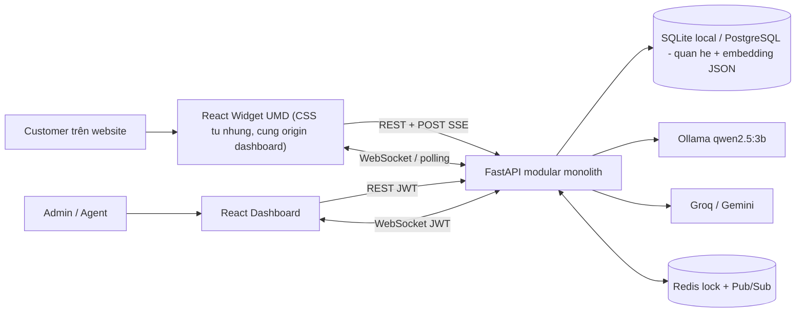
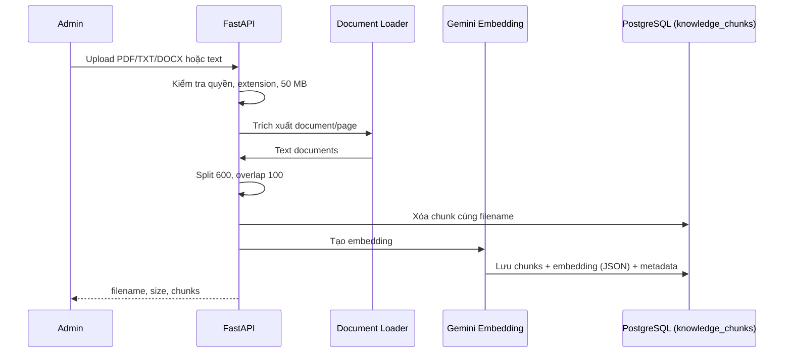

# 10. Kiến trúc phần mềm NovaChat AI

Ngày cập nhật: **19/07/2026**. Tài liệu này mô tả code hiện tại, không phải kiến trúc giả định.

## 1. Phong cách kiến trúc

NovaChat AI là **modular monolith**:

- Một FastAPI backend chứa auth, workspace, RAG, chat, handoff và monetization (Freemium/License Key).
- Một React/Vite dashboard cho Admin/Agent.
- Một React/Vite Library Mode widget độc lập.
- PostgreSQL/SQLite lưu dữ liệu quan hệ **và** embedding tri thức (cột JSON) — **không còn vector
  DB riêng (ChromaDB đã bị bỏ)**, vì Render Free có filesystem ephemeral khiến Chroma mất dữ
  liệu sau mỗi lần restart/redeploy. Similarity tính bằng Python thuần trên embedding lưu trong
  Postgres, hợp lý ở quy mô KB một SME.
- Redis tùy chọn cho distributed lock và Pub/Sub.
- Ollama local cùng Groq/Gemini cloud dùng chung interface và hỗ trợ fallback.

Thiết kế này phù hợp MVP. Repo không dùng Next.js, Preact, Celery, S3/R2 hoặc OpenAI ở thời điểm hiện tại.

## 2. Sơ đồ container



## 3. Cấu trúc code

```text
backend/app/
├── api/deps.py                 # JWT/current user, require_role() (RBAC toan cuc)
├── api/v1/auth.py              # register/login/Google OAuth
├── api/v1/users.py             # profile/password/users
├── api/v1/workspaces.py        # workspace/RBAC (workspace + doi role)/KB/widget config
├── api/v1/chat.py              # RAG/SSE/history/handoff/WebSocket
├── api/v1/admin.py             # Admin Dashboard: License Key, doi plan, tao Staff
├── core/security.py            # password/JWT
├── db/session.py               # SQLAlchemy + legacy schema helpers (khong con db/chroma.py)
├── models/                     # User (role+plan), Workspace, Session, Message, KnowledgeChunk, LicenseKey
├── schemas/                    # Pydantic contracts
├── services/llm.py             # Ollama/Groq/Gemini + fallback
├── services/embeddings.py      # Gemini embedding + feature-hashing fallback
├── services/retrieval.py       # similarity Postgres JSON + BM25 + RRF
├── services/knowledge_store.py # CRUD knowledge_chunks trong Postgres
├── services/licensing.py       # sinh/kich hoat License Key (CSPRNG, rate-limit)
├── services/monetization.py    # quota FREE, watermark
├── services/realtime.py        # WebSocket, Redis Pub/Sub/lock
└── services/observability.py   # JSON log, metrics, rate limit

frontend/src/
├── pages/Dashboard.tsx
├── pages/WorkspaceManagement.tsx
├── pages/BotConfig.tsx
├── pages/KnowledgeBase.tsx
├── pages/Omnibox.tsx
├── pages/Analytics.tsx
├── pages/SystemSettings.tsx
└── services/api.ts

widget/src/
├── config.ts                   # data-* và Vite env
├── api.ts                      # SSE/WebSocket/poll/history
└── App.tsx                     # widget UI/state
```

## 4. Domain và dữ liệu

### SQL entities

- **User:** email, password hash, **global role** `USER`/`STAFF`/`ADMIN` (quyết định quyền vào
  Admin Dashboard, độc lập với role theo workspace), **plan** `FREE`/`PRO`, active flag.
- **Workspace:** owner, system prompt, widget token, `allowed_domains` (JSON, nhiều domain khóa
  nhúng), widget settings, `message_count`/`message_count_period` (hạn mức FREE).
- **WorkspaceMember:** user + workspace + role `admin`/`agent`, unique theo cặp — đổi được sau
  khi đã accept qua `PUT /workspaces/{id}/members/{user_id}/role` (chỉ owner/admin-workspace).
- **WorkspaceInvitation:** email, role, token, status, hạn 7 ngày.
- **ChatSession:** session key, status, assigned Agent và các mốc handoff/fallback
  (`handoff_requested_at`, `fallback_sent_at`).
- **Message:** session, sender (`user`, `bot`, `agent`, `system`), content, timestamp.
- **KnowledgeChunk:** workspace_id, nội dung chunk, **embedding lưu trực tiếp trong cột JSON**,
  version theo model embedding, metadata (`source_filename`, `chunk_index`, `file_size`,
  `file_type`, `uploaded_at`, `page` nếu loader cung cấp).
- **LicenseKey:** mã sinh bằng `secrets` (CSPRNG, định dạng `NOVA-XXXX-XXXX-XXXX-XXXX`), trạng
  thái đã dùng/chưa dùng, gắn với user kích hoạt.

Các trạng thái session:

```text
bot_handling -> waiting_human -> human_handling -> resolved
      ^                                             |
      +------------- customer gửi tin mới ----------+
```

Nhánh timeout (`waiting_human` quá `HUMAN_HANDOFF_TIMEOUT_SECONDS` mà không ai takeover) tự quay
về `bot_handling` sau khi gửi tin nhắn fallback — xử lý ở cả kênh WebSocket (scheduled task) và
polling (`GET /poll`), và **tự chữa cả session đã bị kẹt ở `waiting_human` từ trước khi cơ chế
này tồn tại** (không điều kiện việc trả status theo cờ "đã gửi fallback").

### Embedding & similarity (không còn ChromaDB)

- Embedding của mỗi chunk lưu **trực tiếp trong Postgres** (`KnowledgeChunk.embedding`, cột JSON)
  — không còn vector DB/collection riêng theo workspace.
- Similarity (cosine/L2) tính bằng Python thuần trong `services/retrieval.py` khi truy hồi, lọc
  theo `workspace_id` ngay trong câu query SQL — không có bước "quên filter" riêng vì không có
  tầng vector DB tách biệt để đồng bộ theo.
- Xóa workspace xóa toàn bộ `knowledge_chunks` liên quan trong Postgres (cùng transaction với
  các bảng khác, không phải một hệ thống riêng cần dọn theo).
- Upload cùng filename xóa chunk cũ trước khi thêm mới, như trước.

*(Lịch sử: bản đầu dùng ChromaDB persist ra filesystem của Render — ephemeral trên tier Free,
khiến tri thức mất sau mỗi lần restart/redeploy. Đây là lý do kiến trúc chuyển sang Postgres,
không phải một lựa chọn ban đầu — xem ADR-004 mới và `FINAL_REPORT.md` mục 2.2.)*

## 5. Knowledge ingestion



Ingestion hiện đồng bộ trong HTTP request. Chưa có OCR, object storage, queue hoặc worker.

## 6. RAG và LLM

1. Lưu message của Customer và lấy/tạo `ChatSession`.
2. Nếu session đang chờ/được Agent xử lý, không gọi RAG/LLM.
3. Kiểm tra một số regex prompt injection.
4. Query Top-K (`ChatRequest.top_k` từ 1 đến 5) bằng similarity Python trên embedding JSON trong
   Postgres, lọc `workspace_id` ngay trong câu SQL.
5. Loại chunk rỗng, chứa mẫu injection hoặc distance lớn hơn `RAG_MAX_DISTANCE`.
6. Nếu không còn context, chuyển `waiting_human`, báo Agent và không gọi LLM.
7. Nếu có context, thêm tối đa `CHAT_HISTORY_LIMIT=10` message trước đó vào prompt.
8. Gọi provider đã chọn, thường hoặc streaming; fallback chỉ đổi provider trước chunk đầu tiên.
9. Lưu answer và trả sources.

Embedding production dùng `gemini-embedding-001` 768 chiều với task type bất đối xứng cho document/query. Retrieval lấy semantic candidates bằng similarity Python trên embedding lưu trong Postgres, chấm BM25 trên chunks cùng workspace, gộp thứ hạng bằng RRF và áp dụng confidence trước khi gọi LLM. Feature-hashing 384 chiều chỉ dùng cho local/test khi không có API key. Generation hỗ trợ `ollama`, `groq`, `gemini` và `auto`; chế độ `auto` mặc định thử `ollama,groq,gemini`, bỏ qua cloud provider chưa có API key.

## 7. API và realtime

### REST/SSE

- Auth/users/workspaces dùng REST JSON.
- Upload dùng multipart form-data.
- `POST /api/v1/chat/{workspace_id}` trả answer đầy đủ.
- `POST /api/v1/chat/{workspace_id}/stream` trả SSE events `session`, `chunk`, `human`, `done`, `error`.
- Widget dùng history và poll để khôi phục/fallback.

### WebSocket

`/api/v1/chat/{workspace_id}/ws` nhận query `role=agent|widget`.

- Agent xác thực bằng JWT và membership.
- Widget xác thực bằng widget token, session key và optional origin.
- Connection được giữ trong memory của instance.
- Redis channel `novachat:realtime` chuyển event giữa các instance.

WebSocket truyền tín hiệu thay đổi; dữ liệu bền vẫn nằm trong SQL và được client fetch/poll lại.

## 8. Human Handoff và concurrency

- Customer request hoặc RAG confidence thấp đặt session thành `waiting_human`.
- Agent takeover sử dụng Redis lock `novachat:takeover:<session_id>`.
- Conditional SQL update chỉ assign khi `assigned_agent_id IS NULL`.
- Reply yêu cầu session `human_handling` và đúng assigned Agent.
- Resolve đặt `resolved` và báo widget/Agent.
- Fallback 60 giây chạy bằng asyncio task (kênh WebSocket); poll (`GET /poll`) kiểm tra lại
  timeout để bù cho widget chỉ dùng polling. **Cả hai nhánh trả `status` về `bot_handling`
  ngay sau khi gửi fallback**, và việc trả status không điều kiện theo cờ "đã gửi fallback" —
  nên một session bị kẹt ở `waiting_human` từ trước khi cơ chế này tồn tại cũng tự lành ở lần
  poll kế tiếp, không cần sửa tay dữ liệu (xem `AI_ENGINEERING_REFLECTION.md` mục 3.4).
- Âm thanh (Web Audio API) + Browser Notification báo Agent khi khách yêu cầu handoff, qua event
  `handoff_requested` trên kênh WebSocket — cần Agent bật một lần (yêu cầu tương tác người dùng
  trước khi trình duyệt cho phát âm thanh).

Không có Redis, hệ thống dùng `asyncio.Lock` theo process. Chế độ này chỉ phù hợp local/một instance.

## 9. Authentication và authorization

- Password hash qua Passlib; access token là JWT Bearer.
- Account mới mặc định global role `agent`.
- Google OAuth tạo/tìm user theo email đã xác minh và redirect token về `/login` của frontend.
- **RBAC 2 tầng độc lập:**
  - *Theo workspace:* `WorkspaceMember.role` (`admin`/`agent`) — owner/admin quản lý prompt, KB,
    widget settings, members (kể cả đổi role thành viên hiện có); owner/admin/agent có workspace
    access để xem và xử lý chat.
  - *Toàn cục hệ thống:* `User.role` (`USER`/`STAFF`/`ADMIN`), enforce bằng dependency factory
    `require_role(*roles)` (`api/deps.py`) — quyết định ai vào được Admin Dashboard (quản lý
    License Key, đổi plan `FREE`/`PRO`, tạo tài khoản Staff). Hai tầng này không giao nhau: một
    user có thể là `agent` ở một workspace nhưng `ADMIN` toàn cục, hoặc ngược lại.
- Widget không dùng JWT; dùng `X-Widget-Token` và `allowed_domains` (nhiều domain, so khớp
  `Origin` header).
- Login (`/api/v1/auth/login`) luôn chạy đủ 1 lần `bcrypt.checkpw` kể cả khi email không tồn tại
  (`security.verify_login_password()`, dùng hash giả) — tránh timing side-channel lộ email nào
  đã đăng ký (sửa 19/07, PR #64).

Origin check là defense-in-depth, không chứng minh danh tính client ngoài browser. Widget token cần được coi là public scoped credential.

**Rủi ro bảo mật còn mở (chưa sửa):** `SECRET_KEY` (dùng ký JWT) có fallback hardcode trong code
nếu thiếu biến môi trường — xem `reengineered_docs/08_Risks_Recommendations.md` và
`TODO_BAO_VE.md`.

## 10. CORS

`DynamicCORSMiddleware`:

- Dashboard chỉ được phép từ localhost hoặc `FRONTEND_URL`.
- Chỉ đúng các path công khai thật của widget (`widget-config`, `stream`, `history`, `poll`,
  `request-human`, path gốc POST chat — khớp regex `_PUBLIC_CHAT_PATH`) mới phản chiếu origin
  bất kỳ. Các sub-path còn lại dưới `/api/v1/chat/` (`sessions`, `reply`, `takeover`, `resolve`,
  `stats` — chỉ dành Agent đăng nhập dashboard) không được phản chiếu, dù request có gửi header
  `X-Widget-Token` giả mạo. **Trước 19/07** điều kiện này dựa vào "request có gửi header tên
  `X-Widget-Token` không" (client tự khai, không xác thực giá trị) — đã sửa vì kẻ tấn công tự
  thêm header đó là làm CORS nhận nhầm cả path chỉ-Agent là công khai (PR #64).
- Endpoint chat vẫn tự xác minh token và `allowed_domains` (workspace có thể khóa nhiều domain,
  không chỉ một) — CORS chỉ quyết định trình duyệt có được ĐỌC response không, không phải một
  tầng xác thực; endpoint vẫn phải tự kiểm tra quyền độc lập với CORS.

## 11. Observability và rate limiting

- Log HTTP ở JSON trên stdout.
- Prometheus counter/histogram tại `/metrics`.
- `/health` ping PostgreSQL thật (`SELECT 1`) và trả `uptime_seconds` từ lúc process khởi động —
  không chỉ liveness đơn giản; dashboard (tab Tổng quan) đọc trực tiếp endpoint này, không còn số
  liệu hardcode.
- POST `/api/v1/chat/*` bị rate limit theo IP + path, mặc định 30 request/phút; endpoint kích
  hoạt License Key có rate limit riêng 5 lần/phút/user (sliding window) chống brute-force.

Limiter hiện in-memory, không đồng bộ giữa các instance. `/metrics` chưa có auth trong app.

## 12. Database lifecycle

- Local hỗ trợ SQLite.
- Production hướng tới PostgreSQL.
- Alembic có baseline `20260715_01` tạo schema từ metadata.
- Startup vẫn gọi `create_all()` và `ensure_workspace_schema()`/`ensure_chat_session_schema()` để tương thích database cũ.

Mọi schema change tiếp theo nên có migration Alembic riêng và test upgrade/rollback.

## 13. Build, CI và triển khai

GitHub Actions:

- Python 3.11: install, compile, **8 test scripts** (thêm `test_licensing.py` cho
  Freemium/License Key/Admin RBAC/rate-limit) + 2 bộ pytest (embeddings, retrieval), coverage
  gate 70% (thực tế 78%) và Bandit SAST (thực tế 0 High).
- Node 22: `npm ci`, lint, build cho dashboard và widget.

Deployment artifacts:

- `render.yaml`: backend + dashboard static mẫu.
- `docker-compose.yml`: backend + Redis + dashboard local.
- Widget build: `dist/script.umd.cjs` — CSS đã tự nhúng thẳng vào file này, không còn
  `dist/script.css` riêng để nạp.

LLM trên Render có thể dùng Groq/Gemini; Ollama cần VM riêng. Không còn phụ thuộc persistent
storage riêng cho vector DB (đã bỏ ChromaDB) — Postgres managed của Render đã đủ.

## 14. Rủi ro kiến trúc còn mở

1. Ingestion và fallback task chưa dùng durable worker.
2. Rate limiter chưa distributed.
3. Web Push nền chưa có.
4. Metrics chưa được bảo vệ trong application.
5. Regex prompt injection không thể thay thế defense/evaluation toàn diện.
6. Chưa có automated browser E2E, load test và security test đầy đủ.
7. Chưa có production deployment đã xác nhận với backup/restore/monitoring.
8. Similarity trên Postgres tính bằng Python thuần (không có ANN index) — chấp nhận được ở quy
   mô KB một SME, nhưng sẽ cần đánh giá lại nếu số chunk mỗi workspace tăng rất lớn.
9. Widget không dùng Shadow DOM/iframe (chủ đích, nhẹ + tương thích rộng), nên nội dung render
   qua `ReactMarkdown` có thể bị CSS toàn cục không kiểm soát được của trang host ảnh hưởng —
   giảm nhẹ bằng `!important` scope theo `#novachat-widget-root`, không phải cách ly tuyệt đối.
10. **`SECRET_KEY` có fallback hardcode trong code** (`security.py`, `main.py`) — nếu thiếu biến
    môi trường, app âm thầm ký JWT bằng chuỗi công khai trong repo, cho phép forge token hợp lệ
    cho bất kỳ user. Chưa sửa — mức nghiêm trọng, ưu tiên cao nhất (xem `TODO_BAO_VE.md`).

## 15. Quyết định kiến trúc hiện hành

- **ADR-001:** Modular monolith cho MVP.
- **ADR-002:** Ollama local-first; Groq/Gemini là cloud fallback có cấu hình bằng secrets.
- **ADR-003:** SSE cho token generation; WebSocket cho sự kiện hội thoại.
- **ADR-004:** Embedding lưu trực tiếp trong Postgres (cột JSON) thay vì ChromaDB — tránh phụ
  thuộc filesystem ephemeral của Render Free, đổi lấy việc chưa có ANN index chuyên biệt (chấp
  nhận được ở quy mô hiện tại).
- **ADR-005:** Redis lock + conditional SQL update cho takeover.
- **ADR-006:** Polling là fallback cho widget realtime.
- **ADR-007:** RBAC 2 tầng độc lập (`WorkspaceMember.role` theo workspace, `User.role` toàn cục)
  thay vì một hệ thống role duy nhất — tách rõ "quyền trong một workspace" khỏi "quyền vào khu
  vực quản trị hệ thống" (Admin Dashboard/License Key).
- **ADR-008:** CSS widget dùng `!important` scope theo ID gốc thay vì Shadow DOM/iframe — đổi
  lấy sự đơn giản/tương thích rộng, chấp nhận rủi ro còn lại là CSS host có thể ảnh hưởng widget
  ở mức độ nhất định (xem rủi ro #9).
- **ADR-009:** CORS cho `/api/v1/chat/*` whitelist theo path cố định (regex) thay vì theo sự có
  mặt của header client tự khai — path là thứ server kiểm soát, header do client gửi thì không
  đáng tin để quyết định "đây có phải request công khai không" (sửa 19/07 sau khi rà bảo mật).

**19/07 — kết quả rà bảo mật chủ động** (không chờ báo lỗi từ bên ngoài): tìm và sửa 2 lỗi mức
trung bình (CORS ADR-009, timing side-channel login §9), phát hiện 1 lỗi mức nghiêm trọng còn mở
(`SECRET_KEY` fallback, rủi ro #10) — chi tiết đầy đủ ở `08_Risks_Recommendations.md` và
`EVIDENCE.md` mục 6.

Các quyết định này phù hợp code hiện tại và cần được xem lại khi có production traffic hoặc yêu cầu scale ngang.
