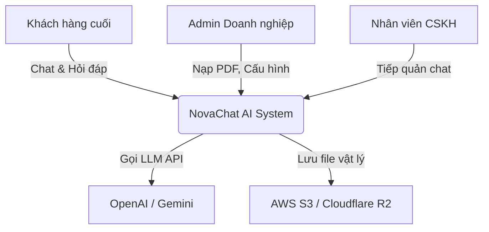
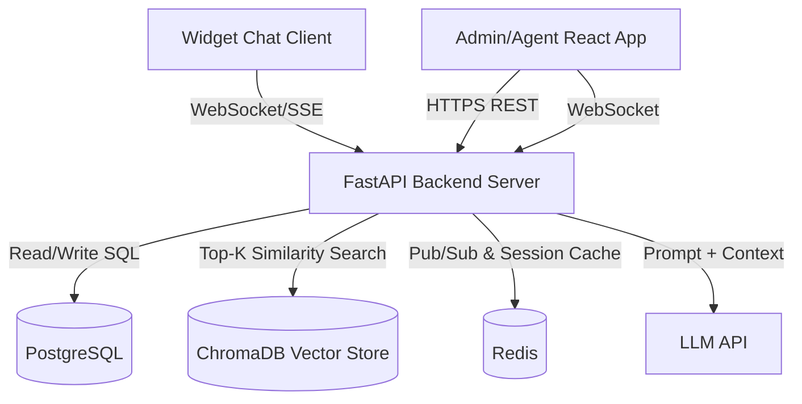

# 10. KIẾN TRÚC PHẦN MỀM CẤP DOANH NGHIỆP (ENTERPRISE SOFTWARE ARCHITECTURE)
*Tài liệu thiết kế kiến trúc hệ thống AI NovaChat dành cho Hội đồng đánh giá, Investor và Đội ngũ Phát triển.*

---

## 1. ĐÁNH GIÁ TỔNG QUAN KIẾN TRÚC (EXECUTIVE ARCHITECTURE ASSESSMENT)
* **Mục tiêu hệ thống:** Xây dựng nền tảng SaaS Multi-tenant cung cấp Chatbot AI (RAG) kết hợp Human-in-the-loop, ưu tiên tốc độ (Time-to-market) cho MVP trong 6 tuần nhưng vẫn đảm bảo khả năng scale lên hàng triệu users.
* **Thách thức kỹ thuật:** Quản lý kết nối WebSocket thời gian thực ở quy mô lớn; Tối ưu hóa độ trễ (latency) của LLM; Ngăn chặn Race Condition khi Handoff; Đảm bảo cách ly dữ liệu Vector tuyệt đối giữa các doanh nghiệp (Data Privacy).
* **Chiến lược kiến trúc:** Khởi đầu với **Modular Monolith** (Kiến trúc khối nguyên phân hệ) kết hợp với **Event-driven** (hướng sự kiện) cho luồng hội thoại. Tuyệt đối KHÔNG lạm dụng Microservices trong giai đoạn này để tránh overhead về DevOps.

---

## 2. PHONG CÁCH KIẾN TRÚC (ARCHITECTURAL STYLE)
**Lựa chọn:** **Modular Monolith (Kiến trúc khối nguyên phân hệ)**
* **Lý do chọn:** Với 1 team 5 người (sinh viên năm nhất/thực tập sinh) và timeline 6 tuần, Microservices sẽ giết chết dự án vì chi phí duy trì infrastructure, CI/CD phức tạp và network latency nội bộ. Modular Monolith gom tất cả logic (Auth, Chat, RAG) vào một server backend duy nhất nhưng phân tách rõ ràng ở cấp độ thư mục (Code-level modules).
* **Trade-offs (Đánh đổi):** Khi một module bị crash (VD: xử lý PDF quá tải), toàn bộ server có thể sập. 
* **Lộ trình Scale:** Khi hệ thống đạt 10,000 users, ta sẽ bóc tách riêng module `Document Ingestion` (Nuốt PDF) thành một Worker Service chạy ngầm (Asynchronous Task Queue qua Celery/Redis) vì tác vụ này ngốn CPU.

---

## 3. KIẾN TRÚC HỆ THỐNG MỨC CAO (HIGH-LEVEL SYSTEM ARCHITECTURE)
Hệ thống gồm 3 phân khu chính:
1. **Client Applications:** 
   - *Admin/Agent SPA:* Next.js/React App quản lý Workspace và trực Omnibox.
   - *Chat Widget:* Preact/Vanilla JS siêu nhẹ nhúng vào website khách hàng.
2. **API & Logic Layer (FastAPI):**
   - *REST API:* Xử lý CRUD (Tạo Workspace, Upload File, Đăng nhập).
   - *WebSocket Server:* Xử lý luồng chat Real-time và Bắn Push Notification cho Agent.
3. **Data Layer:**
   - *PostgreSQL:* Lưu trữ Entity quan hệ (User, Workspace, Chat Session, Message History).
   - *ChromaDB:* Vector Database lưu trữ chunking text từ PDF để truy vấn RAG.
   - *Redis:* In-memory Cache & Message Broker (Pub/Sub) để đồng bộ WebSocket khi scale nhiều backend instances.
4. **AI Services:** 
   - Gọi API bên thứ 3 (OpenAI GPT-4o-mini hoặc Gemini 1.5 Flash) để cân bằng giữa chi phí và độ thông minh.

---

## 4. MÔ HÌNH KIẾN TRÚC C4 (C4 ARCHITECTURE MODEL)

### Level 1 — System Context


### Level 2 — Container Diagram


### Level 4 — Code-Level Suggestions (Backend FastAPI)
```text
backend/
├── app/
│   ├── api/          # Route definitions (REST & WebSocket)
│   ├── core/         # Configs, Security, JWT, DB Sessions
│   ├── models/       # SQLAlchemy ORM Models
│   ├── schemas/      # Pydantic Schemas (Request/Response)
│   ├── services/     # Business logic
│   │   ├── rag_engine.py    # Chunking, Embedding, Retrieval
│   │   ├── chat_service.py  # LLM orchestration, Streaming
│   │   ├── handoff_lock.py  # Race condition locking
│   └── workers/      # Celery tasks (Background PDF processing)
```

---

## 5. MÔ HÌNH DOMAIN (DOMAIN MODEL)
Áp dụng tư duy Domain-Driven Design (DDD), các Aggregate Roots bao gồm:
1. **Workspace:** Mọi dữ liệu (Agent, Bot, Vector, Chat Session) đều phải thuộc về 1 Workspace. Đây là biên giới cách ly dữ liệu (Data Isolation Boundary).
2. **User (Admin/Agent):** Thông tin định danh và phân quyền (RBAC).
3. **Chat Session:** Đại diện cho 1 phiên làm việc. Chứa Trạng thái (Bot-handling, Human-handling, Resolved).
4. **Message:** Các dòng chat thuộc về 1 Session.
5. **Knowledge Document:** Đại diện cho 1 file PDF/Word đã nạp.

---

## 6. KIẾN TRÚC CƠ SỞ DỮ LIỆU (DATABASE ARCHITECTURE)
* **Chiến lược Lựa chọn:** Kết hợp SQL và Vector DB.
* **PostgreSQL (Primary DB):** Rất mạnh trong việc đảm bảo tính toàn vẹn dữ liệu (ACID). Bắt buộc phải có ràng buộc (Foreign Key) `workspace_id` ở mọi bảng để thiết lập Multi-tenancy Row-level security.
  - *Table `chat_sessions`:* Index trên trường `workspace_id` và `status` vì Agent Omnibox sẽ liên tục query các session đang "cần hỗ trợ".
* **ChromaDB (Vector DB):** Lưu trữ nhúng (Embeddings). Mỗi Workspace sẽ tương ứng với một `Collection` riêng biệt trong ChromaDB. Điều này đảm bảo dữ liệu RAG của công ty này không bao giờ nội suy nhầm sang công ty khác.
* **Redis:** Lưu trữ trạng thái Rate Limiting và Lock Management (khi Agent bấm Takeover).

---

## 7. KIẾN TRÚC HỆ THỐNG AI (AI SYSTEM ARCHITECTURE)
* **Luồng RAG (Retrieval-Augmented Generation):**
  1. *Câu hỏi vào:* Biến đổi câu hỏi thành Vector bằng Embedding Model (vd: `text-embedding-3-small`).
  2. *Retrieval:* Query ChromaDB lấy ra Top 3 chunks có độ tương đồng Cosine cao nhất (Top-K = 3).
  3. *Orchestration:* Ráp 3 chunks này vào System Prompt.
  4. *Generation:* Gọi LLM (chế độ Streaming) trả về Frontend.
* **Tối ưu Token & Chi phí:** Áp dụng `ConversationBufferWindowMemory` (Chỉ nhớ 5 câu chat gần nhất của user để làm ngữ cảnh), tránh gửi toàn bộ lịch sử chat dài lê thê cho LLM.
* **Kiểm soát Ảo giác (Hallucination Mitigation):** System Prompt luôn đi kèm chỉ thị: *"Nếu thông tin không nằm trong <context> được cung cấp, hãy phản hồi: Tôi không có thông tin này, bạn có muốn gặp nhân viên không?"*

---

## 8. KIẾN TRÚC API (API ARCHITECTURE)
* **REST API:** Dùng cho mọi tác vụ CRUD không cần thời gian thực (Đăng nhập, Tạo Workspace, Lịch sử Chat). 
  - *Versioning:* `/api/v1/...`
* **WebSocket (hoặc Server-Sent Events - SSE):** Bắt buộc dùng cho luồng Chat (Sinh token của AI) và luồng Omnibox (Báo noti cho Agent).
* **Vì sao không dùng GraphQL?** Dự án MVP cần tốc độ dev nhanh, OpenAPI (Swagger) có sẵn của FastAPI đáp ứng quá đủ nhu cầu contract giữa Backend và Frontend mà không sinh ra N+1 query problem của GraphQL.

---

## 9. KIẾN TRÚC BẢO MẬT (SECURITY ARCHITECTURE)
* **Authentication:** Stateless JWT Token.
* **Authorization:** Role-Based Access Control (Admin vs Agent) kiểm tra qua Dependency Injection của FastAPI.
* **Bảo vệ Widget:** Widget Client-side không chứa JWT (vì rủi ro XSS). Widget dùng một chuỗi `widget_token` (chỉ có quyền read/write chat) được khóa cứng theo Domain name (CORS Origin Check) để tránh kẻ gian lấy mã nhúng cắm sang web khác phá hoại.
* **OWASP Risks:** Ngăn chặn SQL Injection qua SQLAlchemy ORM. Ngăn chặn Prompt Injection bằng cách escape ký tự đặc biệt trước khi đưa vào LangChain.

---

## 10. CHIẾN LƯỢC MỞ RỘNG (SCALABILITY STRATEGY)
* **1,000 Users (MVP):** 1 Backend Server (Render.com), 1 Managed PostgreSQL (Neon.tech). RAM 2GB.
* **10,000 Users:** Bắt đầu nghẽn WebSocket và CPU xử lý PDF. Giải pháp: Tách việc phân rã PDF sang Celery Worker chạy ngầm.
* **100,000 Users:** Thêm nhiều instances FastAPI phía sau Load Balancer. Đưa Redis Pub/Sub vào để đồng bộ kết nối WebSocket (ví dụ: Khách kết nối Server A, Agent kết nối Server B -> Redis giúp 2 server nói chuyện với nhau).
* **1,000,000 Users:** Chuyển sang Microservices thực sự (Tách riêng Chat Service viết bằng Go/Rust, tách riêng AI Service viết bằng Python). Database Sharding theo `workspace_id`.

---

## 11. KIẾN TRÚC HIỆU NĂNG (PERFORMANCE ARCHITECTURE)
* **Mục tiêu Độ trễ (Latency Target):** Thời gian nhận Token đầu tiên (Time to First Token - TTFT) phải dưới **500ms**.
* **Database Optimization:** Mọi truy vấn trong Omnibox (ví dụ: đếm số tin nhắn chưa đọc) phải được Cache trên Redis (TTL 1 phút) thay vì COUNT() liên tục vào PostgreSQL.
* **AI Optimization:** Sử dụng các mô hình nhỏ, tốc độ cao như `gpt-4o-mini` hoặc `claude-3-haiku` thay vì mô hình lớn.

---

## 12. KIẾN TRÚC QUAN SÁT (OBSERVABILITY ARCHITECTURE)
* **Logging:** Ghi log ở định dạng JSON để dễ query.
* **Metrics & Tracing:** Tích hợp Datadog hoặc Prometheus/Grafana để đo đạc các chỉ số:
  - Tỷ lệ Cache Hit/Miss.
  - LLM API Latency & Token Usage (Bắt buộc để tính giá cost).
  - Số lượng WebSocket connection đang mở.

---

## 13. KIẾN TRÚC TRIỂN KHAI (DEPLOYMENT ARCHITECTURE)
* **Cloud Provider:** Render (cho Backend), Vercel (cho Frontend), Neon.tech (cho Serverless PostgreSQL). Lựa chọn này giảm 90% nỗ lực DevOps cho startup.
* **CI/CD:** GitHub Actions. Chạy PyTest, ESLint trước khi merge.
* **Môi trường:** 
  - `Staging`: Để nội bộ test trước khi release.
  - `Production`: Dữ liệu thật, trỏ API key thật.

---

## 14. TECHNOLOGY STACK
| Lớp | Công nghệ | Mục đích | Lợi ích | Rủi ro |
|---|---|---|---|---|
| **Backend** | Python + FastAPI | API & Logic | Native support cho hệ sinh thái AI, Async xịn. | Tốc độ tính toán thuần kém hơn Go. |
| **Frontend**| React (Next.js & Vite) | Giao diện | Phổ biến, dễ tìm nhân sự. | Bundle size lớn nếu nhúng Widget (Cần cấu hình Vite kỹ). |
| **Relational DB**| PostgreSQL | Lưu trữ chính | ACID, JSONB hỗ trợ linh hoạt. | Khó scale write so với NoSQL. |
| **Vector DB** | ChromaDB | Tìm kiếm ngữ nghĩa | Chạy local được, dễ setup. | Có thể nghẽn khi lên hàng triệu Vectors. |
| **Cache/Broker**| Redis | Session, Pub/Sub | Tốc độ siêu cao. | Mất dữ liệu nếu sập (Không quan trọng vì chỉ làm cache). |

---

## 15. RỦI RO KIẾN TRÚC (ARCHITECTURAL RISKS)
* **Risk 1 (AI-Specific): Lộ lọt dữ liệu chéo (Cross-tenant Data Leak).**
  - *Mức độ:* Thảm họa.
  - *Khắc phục:* Bắt buộc gán `workspace_id` vào Metadata của mọi Vector chunk. Bắt buộc filter theo metadata này trong mọi truy vấn Similarity Search.
* **Risk 2 (Operational): Nghẽn cổ chai xử lý file PDF lớn.**
  - *Mức độ:* Cao.
  - *Khắc phục:* Giới hạn cứng dung lượng file upload (10MB). Không xử lý file đồng bộ trong HTTP Request mà chuyển sang Background Task.

---

## 16. QUYẾT ĐỊNH KIẾN TRÚC (ARCHITECTURE DECISION RECORDS - ADR)

**ADR 001: Quản lý Tranh chấp Handoff (Race Condition)**
* **Context:** Nhiều Agent cùng bấm nút "Tiếp nhận" một khách hàng tại cùng một mili-giây.
* **Alternatives:** Row-level lock của SQL vs Distributed Lock của Redis.
* **Chosen Option:** Redis Distributed Lock.
* **Justification:** Khi Agent A bấm, hệ thống tạo key `lock:session_{id}` trong Redis (thời gian sống 5 giây). Agent B bấm sau 50ms sẽ bị Redis chặn lại trả về 409 Conflict. Nhanh hơn và ít tạo gánh nặng cho PostgreSQL.
* **Trade-Offs:** Cần duy trì server Redis.

---

## 17. KẾT LUẬN KIẾN TRÚC (FINAL ARCHITECTURE VERDICT)

Kiến trúc **Modular Monolith kết hợp Event-driven WebSocket** trên nền tảng FastAPI + PostgreSQL + ChromaDB là lựa chọn hoàn hảo và thực tế nhất cho AI NovaChat ở giai đoạn MVP và Growth. 

Nó **Từ chối sự phức tạp thái quá (over-engineering)** của Microservices, tập trung toàn lực vào việc giải quyết bài toán cốt lõi: Kết hợp AI và Con người với độ trễ thấp nhất. Hệ thống phân tách rõ ràng ở cấp độ Module giúp sinh viên/Junior dễ dàng học hỏi và commit code mà không phá hỏng toàn bộ app, đồng thời trải sẵn thảm đỏ để Scale-out lên hàng trăm ngàn users thông qua Redis Pub/Sub trong tương lai. Kiến trúc này hoàn toàn đủ sức bảo vệ trước hội đồng Capstone khắt khe nhất và đủ tiêu chuẩn để các nhà đầu tư (VC) rót vốn Seed-round.
